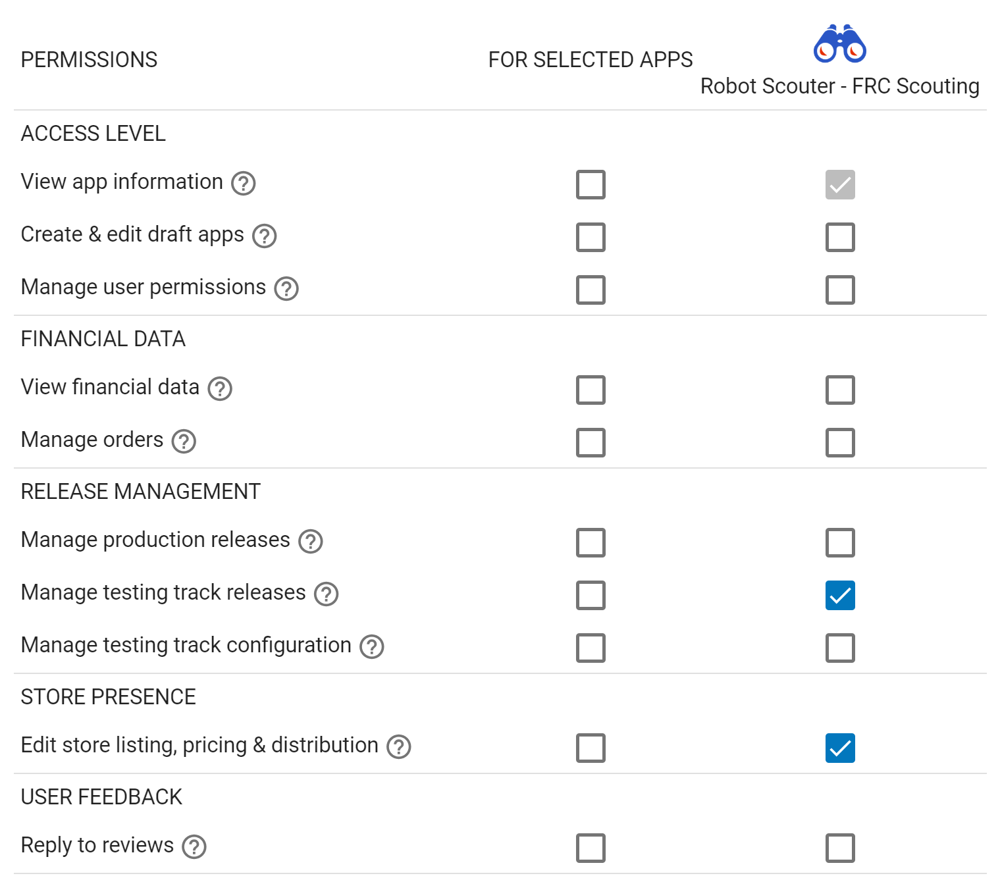

<p align="center">
    
</p>

<h1 align="center">
    Gradle Play Publisher
</h1>

<p align="center">
    <a href="https://github.com/Triple-T/gradle-play-publisher/actions">
        
    </a>
    <a href="https://plugins.gradle.org/plugin/com.github.triplet.play">
        
    </a>
</p>

Gradle Play Publisher (GPP) is Android's unofficial release automation Gradle Plugin. It can do
anything from building, uploading, and then promoting your App Bundle or APK to publishing app
listings and other metadata.

## Project status: maintenance mode

Issues are ignored, but pull requests are not. If you need to get something done, submit a PR!

## Table of contents

1. [Quickstart guide](#quickstart-guide)
2. [Prerequisites](#prerequisites)
    1. [Initial Play Store upload](#initial-play-store-upload)
    2. [Signing configuration](#signing-configuration)
    3. [Service Account](#service-account)
3. [Basic setup](#basic-setup)
    1. [Installation](#installation)
    2. [Authenticating Gradle Play Publisher](#authenticating-gradle-play-publisher)
4. [Task organization](#task-organization)
5. [Managing artifacts](#managing-artifacts)
    1. [Common configuration](#common-configuration)
    2. [Publishing an App Bundle](#publishing-an-app-bundle)
    3. [Publishing APKs](#publishing-apks)
    4. [Uploading an Internal Sharing artifact](#uploading-an-internal-sharing-artifact)
    5. [Promoting artifacts](#promoting-artifacts)
    6. [Handling version conflicts](#handling-version-conflicts)
6. [Managing Play Store metadata](#managing-play-store-metadata)
    1. [Quickstart](#quickstart)
    2. [Directory structure](#directory-structure)
    3. [Publishing listings](#publishing-listings)
    4. [Publishing in-app products](#publishing-in-app-products)
    5. [Publishing in-app subscriptions](#publishing-in-app-subscriptions)
7. [Working with product flavors](#working-with-product-flavors)
    1. [Disabling publishing](#disabling-publishing)
    2. [Combining artifacts into a single release](#combining-artifacts-into-a-single-release)
    3. [Using multiple Service Accounts](#using-multiple-service-accounts)
8. [Advanced topics](#advanced-topics)
    1. [Using CLI options](#using-cli-options)
    2. [Using HTTPS proxies](#using-https-proxies)

## Quickstart guide

1. Upload the first version of your APK or App Bundle using the
   [Google Play Console](https://play.google.com/apps/publish)
2. [Create a Google Play Service Account](#service-account)
3. [Sign your release builds](https://developer.android.com/studio/publish/app-signing#gradle-sign)
   with a valid `signingConfig`
4. [Add and apply the plugin](#installation)
5. [Authenticate GPP](#authenticating-gradle-play-publisher)

## Prerequisites

### Initial Play Store upload

The first APK or App Bundle needs to be uploaded via the Google Play Console because registering the
app with the Play Store cannot be done using the Play Developer API. For all subsequent uploads and
changes, GPP may be used.

### Signing configuration

To successfully upload apps to the Play Store, they must be signed with your developer key. Make
sure you have
[a valid signing configuration](https://developer.android.com/studio/publish/app-signing#gradle-sign).

### Service Account

To use GPP, you must create a service account with access to the Play Developer API:

1. If you don't already have one, create a GCP project for your app(s)
2. Enable the
   [AndroidPublisher API](https://console.cloud.google.com/apis/library/androidpublisher.googleapis.com)
   for that GCP project
3. Create a
   [service account and key](https://console.cloud.google.com/apis/credentials/serviceaccountkey)
    1. Make sure you're in the GCP project you used above (check the `project` query param in the
       URL)
    2. Select `New service account`
    3. Give it a name and the Project Owner role (don't worry, we'll remove this later)
    4. After creating the service account, find it in the list of all service accounts and use the 3
       dots menu to `Manage keys`
    5. From there, create a new key using the `Add key` menu (leave JSON selected)
4. Move the downloaded JSON credentials into your project and
   [tell GPP about it](#authenticating-gradle-play-publisher)
5. Give your service account
   [permissions to publish apps](https://play.google.com/console/developers/users-and-permissions)
   on your behalf
    1. Click `Invite new user`
    2. Copy/paste the service account email (you can find it in the JSON credentials)
    3. Don't touch the roles
    4. Specify which apps the service account should have access to. In this example, GPP has full
       access to testing tracks and app listings, but will be unable to make production releases:
       
6. Run `./gradlew bootstrapListing` or some other GPP task to validate your setup
7. Now that you've successfully created the connection between GCP and Google Play, you can remove
   the Project Owner permissions
    1. Go to your [IAM settings](https://console.cloud.google.com/iam-admin/iam)
    2. Search for the service account you created
    3. Click the edit icon (found at the end of the row)
    4. In the permission selection panel that opens, click the trash icon to remove the owner role
    5. Click save

## Basic setup

### Installation

Apply the plugin to each individual `com.android.application` module where you want to use GPP
through the `plugins {}` DSL:

<details open><summary>Kotlin</summary>

```kt
plugins {
    id("com.android.application")
    id("com.github.triplet.play") version "3.11.0"
}
```

</details>

<details><summary>Groovy</summary>

```groovy
plugins {
    id 'com.android.application'
    id 'com.github.triplet.play' version '3.11.0'
}
```

</details>

#### Snapshot builds

If you're prepared to cut yourself on the bleeding edge of GPP development, snapshot builds are
available from
[Sonatype's `snapshots` repository](https://oss.sonatype.org/content/repositories/snapshots/com/github/triplet/gradle/play-publisher/):

<details open><summary>Kotlin</summary>

```kt
buildscript {
    repositories {
        // ...
        maven("https://oss.sonatype.org/content/repositories/snapshots")
    }

    dependencies {
        // ...
        classpath("com.github.triplet.gradle:play-publisher:4.0.0-SNAPSHOT")
    }
}
```

</details>

<details><summary>Groovy</summary>

```groovy
buildscript {
    repositories {
        // ...
        maven { url 'https://oss.sonatype.org/content/repositories/snapshots' }
    }

    dependencies {
        // ...
        classpath 'com.github.triplet.gradle:play-publisher:4.0.0-SNAPSHOT'
    }
}
```

</details>

### Authenticating Gradle Play Publisher

After you've gone through the [Service Account setup](#service-account), you should have a JSON file
with your private key. Add a `play` block alongside your `android` one with the file's location:

```kt
android { ... }

play {
    serviceAccountCredentials.set(file("your-key.json"))
}
```

> Note: If you commit unencrypted Service Account keys to source, you run the risk of letting anyone
> access your Google Play account. To circumvent this issue, put the contents of your JSON file in
> the `ANDROID_PUBLISHER_CREDENTIALS` environment variable and don't specify the
> `serviceAccountCredentials` property.

#### Application Default Credentials
Alternatively, you can use [Application Default Credentials](https://cloud.google.com/docs/authentication/provide-credentials-adc)
(and optionally [Service Account impersonation](https://cloud.google.com/docs/authentication/use-service-account-impersonation))
instead of specifying a JSON private key file or environment variable:

```kt
android { ... }

play {
    useApplicationDefaultCredentials = true
    impersonateServiceAccount = "account@your-project.iam.gserviceaccount.com" // Optional
}
```

## Task organization

GPP follows the Android Gradle Plugin's (AGP) naming convention: `[action][Variant][Thing]`. For
example, `publishPaidReleaseBundle` will be generated if you have a `paid` product flavor.

Lifecycle tasks to publish multiple product flavors at once are also available. For example,
`publishBundle` publishes all variants.

To find available tasks, run `./gradlew tasks --group publishing` and use
`./gradlew help --task [task]` where `task` is something like `publishBundle` to get more detailed
documentation for a specific task.

## Managing artifacts

GPP supports uploading both the App Bundle and APK. Once uploaded, GPP also supports promoting those
artifacts to different tracks.

### Common configuration

Several options are available to customize how your artifacts are published:

* `track` is the target stage for an artifact, i.e. `internal`/`alpha`/`beta`/`production` or any
  custom track
    * Defaults to `internal`
* `releaseStatus` is the type of release, i.e. `ReleaseStatus.[COMPLETED/DRAFT/HALTED/IN_PROGRESS]`
    * Defaults to `ReleaseStatus.COMPLETED`
* `userFraction` is the percentage of users who will receive a staged release
    * Defaults to `0.1` aka 10%
    * **Note:** the `userFraction` is only applicable where `releaseStatus=[IN_PROGRESS/HALTED]`
* `updatePriority` sets the update priority for a new release. See
  [Google's documentation](https://developer.android.com/guide/playcore/in-app-updates) on consuming
  this value.
    * Defaults to the API value

Example configuration:

```kt
import com.github.triplet.gradle.androidpublisher.ReleaseStatus

play {
    // Overrides defaults
    track.set("production")
    userFraction.set(0.5)
    updatePriority.set(2)
    releaseStatus.set(ReleaseStatus.IN_PROGRESS)

    // ...
}
```

#### Uploading release notes

While GPP can automatically build and find your artifact, you'll need to tell the plugin where to
find your release notes.

Add a file under `src/[sourceSet]/play/release-notes/[language]/[track].txt` where `sourceSet`
is a [full variant name](https://developer.android.com/studio/build/build-variants#sourceset-build),
`language` is one of the
[Play Store supported codes](https://support.google.com/googleplay/android-developer/answer/3125566),
and `track` is the channel you want these release notes to apply to (or `default` if unspecified).

As an example, let's assume you have these two different release notes:

```
src/main/play/release-notes/en-US/default.txt
.../beta.txt
```

When you publish to the beta channel, the `beta.txt` release notes will be uploaded. For any other
channel, `default.txt` will be uploaded.

If no release notes are found, GPP will try to copy release notes from the previous release.

> Note: the Play Store limits your release notes to a maximum of 500 characters.

#### Uploading developer facing release names

The Play Console supports customizing release names. These aren't visible to users, but may be
useful for internal processes. Similar to release notes, release names may be specified by placing
a `[track].txt` file in the `release-names` directory under your `play` folder. For example, here's
a custom release name for the alpha track in the `play/release-names/alpha.txt` file:

```
My custom release name
```

If it makes more sense to specify the release name in your build script, the `releaseName` property
is available:

```kt
play {
    // ...
    releaseName.set("My custom release name")
}
```

> Note: the `play.releaseName` property takes precedence over the resource files.

There is also a `--release-name` CLI option for quick access. For example,
`./gradlew publishBundle --release-name "Hello World!"`.

> Note: the Play Store limits your release names to a maximum of 50 characters.

#### Uploading a pre-existing artifact

By default, GPP will build your artifact from source. In advanced use cases, this might not be the
desired behavior. For example, if you need to inject translations into your APK or App Bundle after
building it but before publishing it. Or perhaps you simply already have an artifact you wish to
publish. GPP supports this class of use cases by letting you specify a directory in which
publishable artifacts may be found:

```kt
play {
    // ...
    artifactDir.set(file("path/to/apk-or-app-bundle/dir"))
}
```

For quick access, you can also use the `--artifact-dir` CLI option:

```sh
./gradlew publishBundle --artifact-dir path/to/app-bundle/dir
```

> Note: all artifacts in the specified directory will be published.

##### Uploading mapping files

> Note: mapping files aren't applicable to App Bundles since the mapping file is contained within
> the bundle.

By default, GPP will look for a file called `mapping.txt` in your artifact directory. If you need
more granularity, you can prefix `mapping.txt` with your APK file name. For example:

```
artifact-dir/
├── mapping.txt
├── my-first-app.apk
├── my-second-app.apk
└── my-second-app.mapping.txt
```

`my-second-app.apk` will use `my-second-app.mapping.txt` and `my-first-app.apk` will use the
default `mapping.txt` because no specific mapping file was specified.

#### Retaining artifacts

GPP supports keeping around old artifacts such as OBB files or WearOS APKs:

```kt
play {
    // ...
    retain {
        artifacts.set(listOf(123)) // Old APK version code
        mainObb.set(123) // Old main OBB version code
        patchObb.set(123) // Old patch OBB version code
    }
}
```

### Publishing an App Bundle

Run `./gradlew publishBundle`.

#### Defaulting to the App Bundle

You'll notice that if you run `./gradlew publish`, it uploads an APK by default. To change this,
default to the App Bundle:

```kt
play {
    // ...
    defaultToAppBundles.set(true)
}
```

### Publishing APKs

Run `./gradlew publishApk`. Splits will be uploaded if available.

### Uploading an Internal Sharing artifact

Run `./gradlew uploadReleasePrivateBundle` for App Bundles and `./gradlew uploadReleasePrivateApk`
for APKs. To upload an existing artifact, read about
[how to do so](#uploading-a-pre-existing-artifact).

#### Retrieving the download URL

After running an Internal Sharing task, the output of the API response will be stored in the
following directory: `build/outputs/internal-sharing/[bundle/apk]/[variant]/`. Each file will be
named `[apk/aab name].json`.

For example, here are the contents
of `app/build/outputs/internal-sharing/bundle/release/app-release.json`:

```json
{
    "certificateFingerprint": "...",
    "downloadUrl": "...",
    "sha256": "..."
}
```

#### Installing Internal Sharing artifacts

To accelerate development, GPP supports uploading and then immediately installing Internal Sharing
artifacts. This is similar to the AGP's `install[Variant]` task.

Run `./gradlew installReleasePrivateArtifact` to install an artifact built on-the-fly and
`./gradlew uploadReleasePrivateBundle --artifact-dir path/to/artifact installReleasePrivateArtifact`
to install an existing artifact.

### Promoting artifacts

Existing releases can be promoted and/or updated to the [configured track](#common-configuration)
with `./gradlew promoteArtifact`.

By default, the track *from* which to promote a release is determined by the most unstable channel
that contains a release. Example: if the alpha channel has no releases, but the beta and prod
channels do, the beta channel will be picked. To configure this manually, use the `fromTrack`
property:

```kt
play {
    // ...
    fromTrack.set("alpha")
}
```

Similarly, the track *to* which to promote a release defaults to the `promoteTrack` property. If
unspecified, the resolved `fromTrack` property will be used instead and an in-place update will be
performed. Example configuration:

```kt
play {
    // ...
    promoteTrack.set("beta")
}
```

If you need to execute a one-time promotion, you can use the CLI args. For example, this is how you
would promote an artifact from the alpha ➡️ beta track with only 25% of users getting the release:

```sh
./gradlew promoteArtifact \
  --from-track alpha --promote-track beta \
  --release-status inProgress --user-fraction .25
```

If you only need to update the rollout percentage of an existing in-progress release, you can do so
with the `update` flag. For example, this is how you would increase the production track rollout
percentage to 50% of users.

```sh
./gradlew promoteArtifact --update production --user-fraction .5
```

#### Finishing a rollout

If you have an ongoing `inProgress` release and would like to perform a full rollout, simply change
the release status to `completed`. A user fraction of `1.0` is invalid and will be rejected.

### Handling version conflicts

If an artifact already exists with a version code greater than or equal to the one you're trying to
upload, an error will be thrown when attempting to publish the new artifact. You have two options:

* Ignore the error and continue (`ResolutionStrategy.IGNORE`)
* Automatically pick the correct version code so you don't have to manually update it
  (`ResolutionStrategy.AUTO`)

Example configuration:

```kt
import com.github.triplet.gradle.androidpublisher.ResolutionStrategy

play {
    // ...
    resolutionStrategy.set(ResolutionStrategy.IGNORE)
}
```

#### Post-processing outputs sanitized by auto resolution

For example, you could update your app's version name based on the new version code:

```kt
import com.github.triplet.gradle.androidpublisher.ResolutionStrategy

play {
    // ...
    resolutionStrategy.set(ResolutionStrategy.AUTO)
}

androidComponents {
    onVariants { variant ->
        for (output in variant.outputs) {
            val processedVersionCode = output.versionCode.map { playVersionCode ->
                // Do something to the version code...
                // In this example, version names will look like `myCustomVersionName.123`
                "myCustomVersionName.$playVersionCode"
            }

            output.versionName.set(processedVersionCode)
        }
    }
}
```

## Managing Play Store metadata

GPP supports uploading any metadata you might want to change with each release, from screenshots and
descriptions to in-app purchases and subscriptions.

### Quickstart

GPP includes a bootstrap task that pulls down your existing listing and initializes everything for
you. To use it, run `./gradlew bootstrapListing`.

> Note: if you have a pre-existing `play` folder, it will be reset.

### Directory structure

GPP follows the Android Gradle Plugin's source set
[guidelines and priorities](https://developer.android.com/studio/build/build-variants#sourceset-build).
`src/[sourceSet]/play` is the base directory for Play Store metadata. Since `main` is the most
common source set, it will be assumed in all following examples.

In addition to merging metadata across variants, GPP merges translations. That is, if a resources is
provided in a default language such as `en-US` but not in `fr-FR`, the resource will be copied over
when uploading French metadata.

### Publishing listings

Run `./gradlew publishListing`.

#### Uploading global app metadata

Base directory: `play`

 File                   | Description
------------------------|--------------------------------------------------------------------------------------------------
 `contact-email.txt`    | Developer email
 `contact-phone.txt`    | Developer phone
 `contact-website.txt`  | Developer website
 `default-language.txt` | The default language for both your Play Store listing and translation merging as described above

#### Uploading text based listings

Base directory: `play/listings/[language]` where `language` is one of the
[Play Store supported codes](https://support.google.com/googleplay/android-developer/answer/3125566)

 File                    | Description           | Character limit
-------------------------|-----------------------|-----------------
 `title.txt`             | App title             | 50
 `short-description.txt` | Tagline               | 80
 `full-description.txt`  | Full description      | 4000
 `video-url.txt`         | Youtube product video | N/A

#### Uploading graphic based listings

Directory: `play/listings/[language]/graphics` where `language` is defined as in the previous
section

Image files are organized a bit differently than in previous sections. Instead of the file name, the
parent directory's name is used as the media type. This is because multiple images may be provided
for the same media type. While file names are arbitrary, they will be uploaded in alphabetical order
and presented on the Play Store as such. Therefore, we recommend using a number as the file name
(`1.png` for example). Both PNG and JPEG images are supported.

 Directory                  | Max # of images | Image dimension constraints (px)
----------------------------|-----------------|----------------------------------
 `icon`                     | 1               | 512x512
 `feature-graphic`          | 1               | 1024x500
 `phone-screenshots`        | 8               | [320..3840]x[320..3840]
 `tablet-screenshots`       | 8               | [320..3840]x[320..3840]
 `large-tablet-screenshots` | 8               | [320..3840]x[320..3840]
 `tv-banner`                | 1               | 1280x720
 `tv-screenshots`           | 8               | [320..3840]x[320..3840]
 `wear-screenshots`         | 8               | [320..3840]x[320..3840]

### Publishing in-app products

Run `./gradlew publishProducts`.

Manually setting up in-app purchase files is not recommended. [Bootstrap them instead](#quickstart)
with `./gradlew bootstrapListing --products`.

### Publishing in-app subscriptions

Run `./gradlew publishSubscriptions`.

Manually setting up in-app subscriptions files is not recommended. [Bootstrap them instead](#quickstart)
with `./gradlew bootstrapListing --subscriptions`.

Each subscription file must have an associated metadata file (`subscriptions/<subscription product id>.metadata.json`)
that contains JSON of the form `{"regionsVersion": ...}`. The `regionsVersion` is described
[here](https://developers.google.com/android-publisher/api-ref/rest/v3/RegionsVersion). The Google Play Developer API does
not have a way to get the latest regions version, so unfortunately bootstrapping uses a hardcoded value that you may need to fix.

## Working with product flavors

When working with product flavors, granular configuration is key. GPP provides varying levels of
granularity to best support your needs, all through the `playConfigs` block:

<details open><summary>Kotlin</summary>

```kt
play {
    // In a simple app, this play block is all you'll need. However, in an app with product flavors,
    // the play block becomes a place to store default configurations. Anything configured in here
    // will apply to all product flavors, that is, unless an override is supplied in the playConfigs
    // block.
}

android {
    // Suppose we have the following flavors
    flavorDimensions("customer", "type")
    productFlavors {
        register("firstCustomer") { setDimension("customer") }
        register("secondCustomer") { setDimension("customer") }

        register("demo") { setDimension("type") }
        register("full") { setDimension("type") }
    }

    playConfigs {
        // Now, we can configure GPP however precisely is required.

        // Configuration overrides occur in a cascading manner from most to least specific. That is,
        // a property configured in a build type + flavor combo overrides that same property
        // configured in a flavor combo, which overrides a build type combo, which in turn overrides
        // the play block. Properties not configured are inherited.
        register("firstCustomerFullRelease") { ... } // Build type + flavor
        register("firstCustomer") { ... } // Flavor
        register("release") { ... } // Build type
    }
}
```

</details>

<details><summary>Groovy</summary>

```groovy
play {
    // In a simple app, this play block is all you'll need. However, in an app with product flavors,
    // the play block becomes a place to store default configurations. Anything configured in here
    // will apply to all product flavors, that is, unless an override is supplied in the playConfigs
    // block.
}

android {
    // Suppose we have the following flavors
    flavorDimensions 'customer', 'type'
    productFlavors {
        firstCustomer { dimension 'customer' }
        secondCustomer { dimension 'customer' }

        demo { dimension 'type' }
        full { dimension 'type' }
    }

    playConfigs {
        // Now, we can configure GPP however precisely is required.

        // Configuration overrides occur in a cascading manner from most to least specific. That is,
        // a property configured in a build type + flavor combo overrides that same property
        // configured in a flavor combo, which overrides a build type combo, which in turn overrides
        // the play block. Properties not configured are inherited.
        firstCustomerFullRelease { ... } // Build type + flavor
        firstCustomer { ... } // Flavor
        release { ... } // Build type
    }
}
```

</details>

### Disabling publishing

Sometimes, you may not want to publish all variants of your app. Or maybe you don't want publishing
enabled on CI or local dev machines. Whatever the case may be, GPP can be disabled with the
`enabled` property:

<details open><summary>Kotlin</summary>

```kt
android {
    // ...

    playConfigs {
        register("myCustomVariantOrProductFlavor") {
            enabled.set(true)
        }

        // ...
    }
}

play {
    enabled.set(false) // This disables GPP by default. It could be the other way around.
    // ...
}
```

</details>

<details><summary>Groovy</summary>

```groovy
android {
    // ...

    playConfigs {
        myCustomVariantOrProductFlavor {
            enabled.set(true)
        }

        // ...
    }
}

play {
    enabled.set(false) // This disables GPP by default. It could be the other way around.
    // ...
}
```

</details>

### Combining artifacts into a single release

By default, GPP assumes every product flavor consists of a separate, independent app. To tell GPP
this isn't the case, you must use the `commit` property:

<details open><summary>Kotlin</summary>

```kt
// Don't commit any changes by default
play.commit.set(false)

android {
    // ...

    playConfigs {
        register("someFlavorThatWillCommit") {
            // Pick a flavor that will commit the changes prepared by all flavors
            commit.set(true)
        }
    }
}

afterEvaluate {
    // Now make sure the tasks execute in the right order
    val intermediateTasks = listOf(
            "publishSomeFlavor2Release[Apk/Bundle]",
            "publishSomeFlavor3Release[Apk/Bundle]",
            ...
    )

    // The commit flavor task must run last so the other tasks can build up changes to commit
    tasks.named("someFlavorThatWillCommitRelease[Apk/Bundle]").configure {
        mustRunAfter(intermediateTasks)
    }
}
```

</details>

<details><summary>Groovy</summary>

```groovy
// Don't commit any changes by default
play.commit.set(false)

android {
    // ...

    playConfigs {
        someFlavorThatWillCommit {
            // Pick a flavor that will commit the changes prepared by all flavors
            commit.set(true)
        }
    }
}

afterEvaluate {
    // Now make sure the tasks execute in the right order
    def intermediateTasks = [
            "publishSomeFlavor2Release[Apk/Bundle]",
            "publishSomeFlavor3Release[Apk/Bundle]",
            ...
    ]

    // The commit flavor task must run last so the other tasks can build up changes to commit
    tasks.named("someFlavorThatWillCommitRelease[Apk/Bundle]").configure {
        mustRunAfter(intermediateTasks)
    }
}
```

</details>

### Using multiple Service Accounts

If you need to publish each build flavor to a separate Play Store account, simply provide separate
credentials per product flavor.

<details open><summary>Kotlin</summary>

```kt
android {
    // ...

    playConfigs {
        register("firstCustomer") {
            serviceAccountCredentials.set(file("customer-one-key.json"))
        }

        register("secondCustomer") {
            serviceAccountCredentials.set(file("customer-two-key.json"))
        }
    }
}
```

</details>

<details><summary>Groovy</summary>

```groovy
android {
    // ...

    playConfigs {
        firstCustomer {
            serviceAccountCredentials.set(file('customer-one-key.json'))
        }

        secondCustomer {
            serviceAccountCredentials.set(file('customer-two-key.json'))
        }
    }
}
```

</details>

## Advanced topics

### Using CLI options

All configuration options available in the `play` block are also available as CLI options so you
don't have to update your build file when making one-time changes. For example, to configure
`play.track` on demand, use the `--track` option. `camelCase` options are converted to
`kebab-case` ones.

To get a list of options and their quick documentation, use `./gradlew help --task [task]` where
`task` is something like `publishBundle`.

### Using HTTPS proxies

If you need to use GPP behind an HTTPS-proxy, but it fails with an `SSLHandshakeException`, you can
provide your own truststore via the `javax.net.ssl.trustStore` property in your project's
`gradle.properties`:

```properties
systemProp.javax.net.ssl.trustStore=/path/to/your/truststore.ks
systemProp.javax.net.ssl.trustStorePassword=YourTruststorePassword
```

GPP will automatically pick it up and use your proxy.
